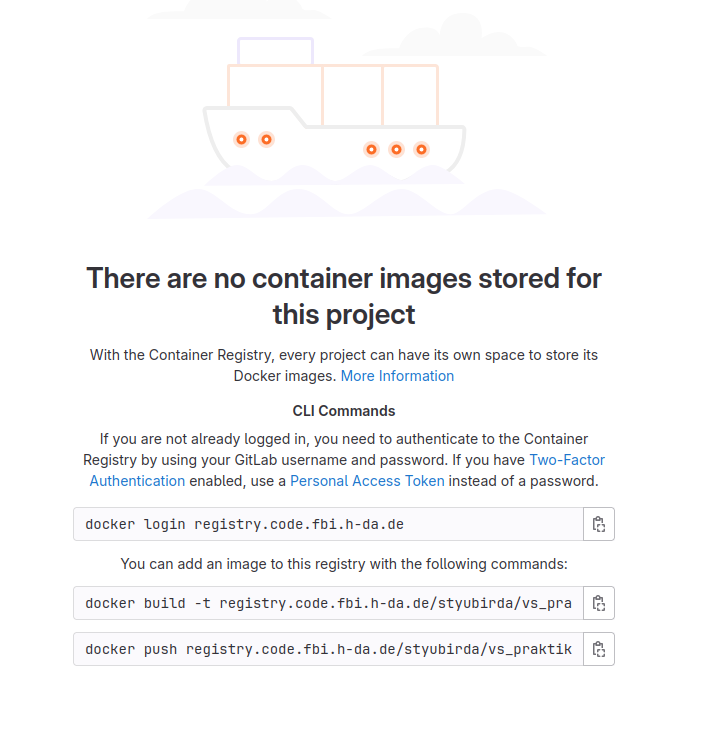

# Kubernetes-Based Web App

## Overview

Hey there! This project is a simple web app running on Kubernetes. It's a basic user management app where you can add, list, and delete users. It's backed by a MongoDB database, and it showcases some cool Kubernetes features like Deployments, StatefulSets, Jobs, Services, RBAC, ConfigMaps, and Secrets.

## Features

- **User Management**: Add, list, and delete users through a simple web interface.
- **Scalable**: Easily scale the web app with Kubernetes Deployments.
- **Persistent Storage**: MongoDB uses a StatefulSet with persistent storage.
- **Config and Secrets**: Uses ConfigMaps for configuration and Secrets for sensitive data.
- **Access Control**: Define accessibility for users or groups using ServiceAccounts, Role and RoleBinding
- **Resource Limitation**: Control the amount of computing resource that can be used
## What You Need

- A Kubernetes cluster
- `kubectl` set up and pointing to your cluster
- Docker for building and pushing images
- A container registry (like Docker Hub)

## How to Get It Running

### 1. Clone the Repo

First, grab the code:

```bash
git clone <repository-url>
cd <repository-directory>
```

### 2. Build and Push Docker Images

Build the Docker image for the web app:

```bash
docker build -t registry.code.fbi.h-da.de/kubermates/devops-kubernetes/<optional-image-name>:<optional-tag> .
   [EXAMPLE] docker build -t registry.code.fbi.h-da.de/kubermates/devops-kubernetes/web-app:v1.4 .
docker push registry.code.fbi.h-da.de/kubermates/devops-kubernetes/web-app:v1.4
```



### 3. Apply Kubernetes Manifests

We have a handy shell script that applies all the necessary Kubernetes manifests for you. The script will apply the ConfigMaps, Secrets, Deployments, StatefulSets, Services, and RBAC configurations.
Also if you need to for any reason to re-deploy or simply delete the deploy, we have prepared a script for that as well. Both scripts are in scripts folder.

Side note: please do make sure that the image name that is used in the app.yaml is consistent with the name you've assigned, otherwise the app can't pull the image...

**Name of the deployment script:** `deploy.sh`

**Name of the deletion script:** `delete-deploy.sh`
Make the script executable and run it:

```bash
chmod +x deploy.sh
./deploy.sh
```

### 4. Access the App

**Get the NodePort for the Web App**:
Run the following to find the NodePort for the `web-app-service`:

```bash
kubectl get services -n kubermates
```

Access the web app at `http://<node-ip>:<node-port>`.

**Use the App**:
Use the web interface to add, list, and delete users. The app connects to MongoDB to handle these operations.

## Notes

- **ConfigMaps**: Store non-sensitive settings like environment and database connection details.
- **Secrets**: Securely store sensitive data like passwords.
- **RBAC**: Role Based Access Control
- **Kubernetes Resource Management**
  - Use **`LimitRange`** to enforce resource constraints on individual containers.
  - Use **`ResourceQuota`** to enforce overall resource constraints on a namespace.


