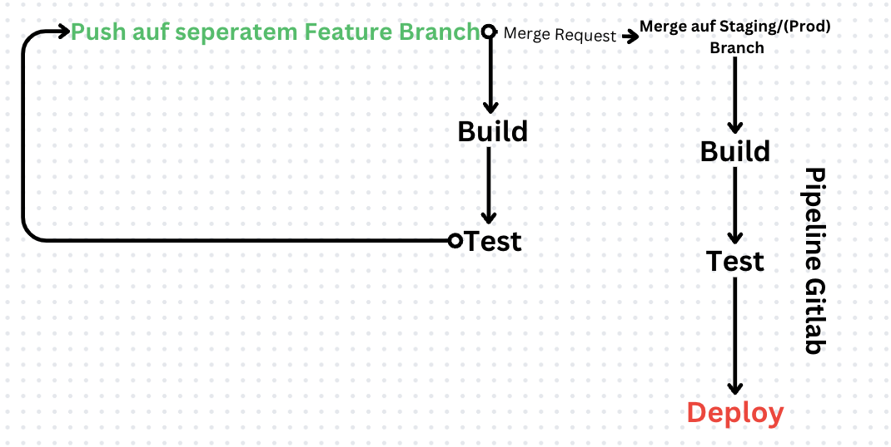
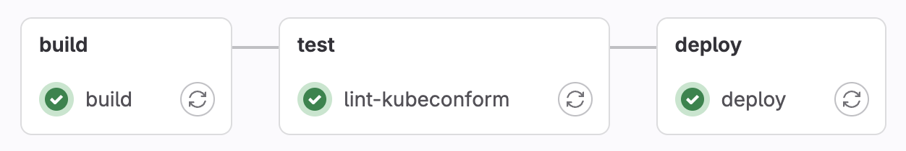
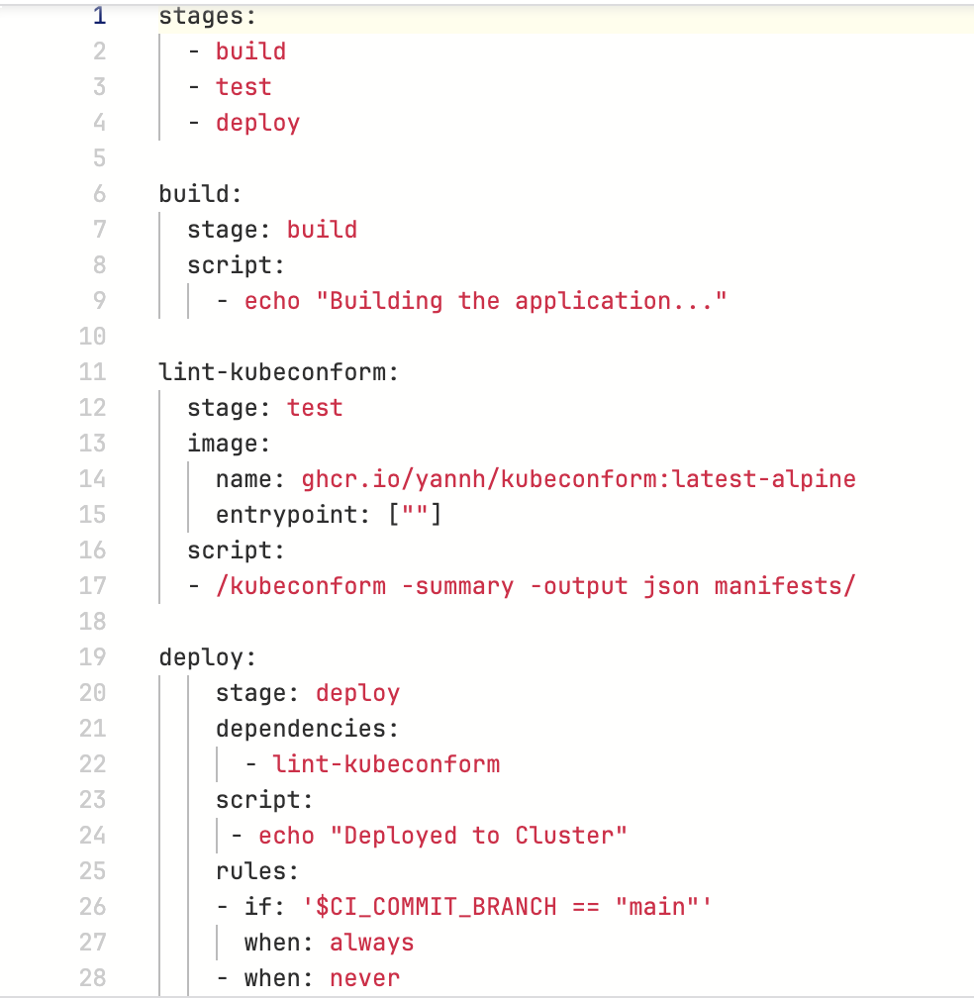
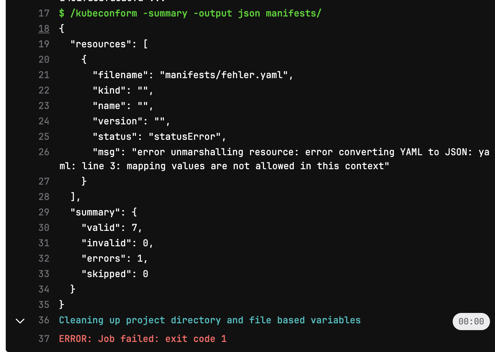

# Aufgabe 4 - Spike: CI/CD

## Konzept für einen automatisierten Prozess

### Prozessbeginn
Unser Prozess beginnt bei der Erstellung oder Änderung des Codes im Entwicklungszweig (z.B. `feature` oder `fix` Branch). Sobald ein Entwickler eine Änderung vorgenommen hat, wird ein Merge Request erstellt. Dieser MR durchläuft Code-Reviews und automatisierte Tests, bevor er in den Hauptzweig (`Staging` oder `Prod`) integriert wird.

### Automatisierte Schritte
Die Änderungen müssen ggf. gebaut, aufjedenfall getestet und bei erfolgreichen Tests deployed werden.

### Branching Strategie
Man verwendet seperate, vom `Staging` Branch erstellte, Branches für jede Änderung. Hier arbeitet man an den Änderungen und erstellt, wenn diese abgeschlossen sind einen Merge Request auf den `Staging` Branch

### GitLab Pipelines
Man verwendet Gitlab Pipelines um die Notwendigen automatisierten Schritte auszufhren. Hierbei handelt es sich um:
- Build
- Test
- Deploy

### Deployment Strategie
Im Endeffekt macht es wenig Unterschied für welche wir uns entscheiden, da wir ja im Rahmen eines Praktikums arbeiten und somit keine Nutzer haben bzw. Punkte wie Downtime in Kauf nehmen können.

Mögliche Strategien, die Sinn machen,
- Recreate Deployment
    - Die alte Version der Anwendung wird vollständig gestoppt und die neue Version wird gestartet.
    - Warum?
        - Einfachste Implementierung
        - Downtime kann in Kauf genommen werden
- Blue-Green Deployment
    - Zwei identische Produktionsumgebungen (Blue und Green) werden verwendet. Die neue Version wird in der inaktiven Umgebung (z.B. Green) bereitgestellt und nach erfolgreichem Testen wird der Traffic umgeschaltet.
    - Warum?
        - Keine Downtime, einfache Rollbacks
        - Kosten für doppelte Infrastruktur kann man in Kauf nehmen, da wir sowieso ein kleines Projekt mit kaum Kosten haben
        
## Technischer Durchstich

### Implementierung

- Der `build` Job ist ein Placeholder, da wir nichts builden mssen momentan
- Der `test` Job fhrt die Tests von `Kubeconform`durch, die die aktualisierten Manifests im Manifests Ordner berprfen.
- Der `deploy` Job ist ein Placeholder, da der Gitlab Agent nochnicht funktioniert

### Gitlab Agent

(Wir verwenden einen Gitlab Agent in unserem Kubernetes Cluster, der in einem Pod in einem eigenen Namespace läuft um Änderungen zu deployen.)

### Beispieländerung

Beispiel mit Fehlerhafter Manifest Datei.

### Probleme
Welche Probleme sind aufgetreten?
- Gitlab Agent Pods im Cluster haben keine Verbindung zum Gitlab Agent, somit kann nicht automatisch deployed werden.