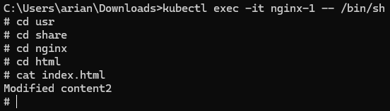

# Aufgabe 3 - StatefulSet

## Hilfreiche Links
- [StatefulSet-Konzept](https://kubernetes.io/docs/concepts/workloads/controllers/statefulset/)
- [Grundlegendes StatefulSet-Tutorial](https://kubernetes.io/docs/tutorials/stateful-application/basic-stateful-set/)

## Aufgabenbeschreibung

1. **Vorbereitung**
    - Informieren Sie sich vorab über die aktuellen Versionen des nginx Images.
        - Die neueste Version ist 1.27.0, aber wir verwenden ein älteres Image, zum Beispiel 1.19.3.
    - Erstellen Sie ein StatefulSet bestehend aus 2 Replicas und nutzen Sie dafür ein etwas älteres nginx Image.
        - [k8s_stateful_set_create_2_replicas.yaml](k8s_stateful_set_create_2_replicas.yaml)
    - Beachten Sie dabei die [StatefulSet Limitations](https://kubernetes.io/docs/concepts/workloads/controllers/statefulset/#limitations).
    - Provisionieren Sie bereits vorab 4 entsprechende PVs (Persistent Volumes).
        - [k8s_add_pc_and_pvc.yaml](k8s_add_pc_and_pvc.yaml)
    - Denken Sie an die Erstellung eines Headless Service.
        - [k8s_stateful_set_create_headless_service.yaml](k8s_stateful_set_create_headless_service.yaml)

2. **Implementierung**
    - Kontrollieren Sie die erfolgreiche Provisionierung Ihrer Ressourcen mittels `kubectl get all` und `get pvc`.
    - Ich musste noch ein nginx-service yaml geschrieben auf Grund von Verbindungsproblemen: [nginx-service.yaml](nginx-service.yaml)

3. **Laufzeitmodifikationen**
    - Verändern Sie die `index.html` Ihrer nginx Instanzen zur Laufzeit, indem Sie z.B. einen bestimmten String in die jeweilige `index.html` injecten.
        - `kubectl exec -it <pod-name> -- /bin/sh` und `echo "Modified content" > /usr/share/nginx/html/index.html`
    - Kontrollieren Sie mittels `curl`, dass die nginx Webserver ihre modifizierten Daten ausliefern.
        - Ich musste port-forwarding machen, da es Probleme mit dem Netzwerk gab.
        - `kubectl port-forward svc/nginx-service 8080:80`
    - Löschen Sie die Pods (nicht das StatefulSet) und warten Sie, bis die Pods wieder laufen.
        - `kubectl delete pod <pod-name>`
    - Überprüfen Sie nochmals mittels `curl`, dass die nginx Webserver ihre modifizierten Daten ausliefern.
        - 

4. **Skalierung**
    - Skalieren Sie das StatefulSet auf 4 Replicas, dann auf 1 Replica und schließlich wieder auf 2 Replicas.
        - Skalierung habe ich mit dem Dashboard gemacht.
        
        
        
    - Beobachten Sie dabei die geordnete und sequentielle Reihenfolge der Instantiierung und kontrollieren Sie jeweils, welche Daten die nginx Webserver ausliefern.
    - Modifizieren Sie gegebenenfalls die `index.html` der "neuen" Replicas erneut.
    - Änderungen blieben erhalten:
    

5. **Update**
    - Ändern Sie abschließend das nginx Image auf eine neuere Version.
    - Beobachten Sie (zum Beispiel mit dem `WATCH` Flag), wie sich das Update mit der RollingUpdate Strategie verhält.
        - `while ($true) { kubectl get pods; Start-Sleep -Seconds 2 }` in Powershell anstelle von watch(Windows 11).
    - Inwiefern unterscheidet sich das StatefulSet bezüglich Update und Skalieren von einem Deployment?
        Deployment:
        1. Zu Beginn haben wir zwei Pods (nginx-854cbf5845-b4brw und nginx-854cbf5845-hlwkm), die seit etwa 3 Minuten und 55 Sekunden laufen.
        2. Zwei neue Pods (nginx-5dfcd97b66-kb7gp und nginx-5dfcd97b66-rrt28) werden erstellt und befinden sich im Status ContainerCreating.
        3. Der alte Pod nginx-854cbf5845-hlwkm beginnt zu terminieren, während einer der neuen Pods (nginx-5dfcd97b66-kb7gp) weiterhin im Status ContainerCreating ist.
        4. Einer der neuen Pods (nginx-5dfcd97b66-kb7gp) ist jetzt vollständig im Status Running, während der andere neue Pod (nginx-5dfcd97b66-rrt28) noch im Status ContainerCreating ist.
        5. Beide neuen Pods (nginx-5dfcd97b66-kb7gp und nginx-5dfcd97b66-rrt28) sind nun vollständig im Status Running. Der alte Pod nginx-854cbf5845-hlwkm wurde terminiert und entfernt.
        

        StatefulSets:
        1. Pod-Basiertes Update: Im Gegensatz zu Deployments, bei denen mehrere Pods gleichzeitig aktualisiert werden können, aktualisiert ein StatefulSet seine Pods nacheinander. Das bedeutet, dass der Pod mit der höchsten Ordnungszahl zuerst aktualisiert wird (z.B. nginx-1 vor nginx-0).
        2. Erhalt der Reihenfolge und Identität: Die Pods eines StatefulSets behalten ihre Identität (z.B. nginx-0, nginx-1), was wichtig für zustandsbehaftete Anwendungen ist.
        3. Partitionsstrategie: man kann die partition-Option verwenden, um anzugeben, welche Pods aktualisiert werden sollen. Wenn die Partition z.B. auf 1 gesetzt ist, wird nur der Pod nginx-1 aktualisiert und nginx-0 bleibt unverändert, bis die Partition auf 0 gesetzt wird.

    - Unterschiede zwischen StatefulSet und Deployment:
        - StatefulSet: Beibehaltung der Pod-Identität und stabiler Speicher
        - Deployment: Flexible Skalierung und Upgrades ohne festgelegte Reihenfolge
        

6. **Key Learnings:**
    - StatefulSet: Verstehen der StatefulSet-Limitations und der geordneten/sequenziellen Pod-Instantiierung.
    - Persistent Volumes: Manuelle Erstellung und Verwaltung von PVs.
    - Datenpersistenz: Sicherstellen, dass Daten über Pod-Neustarts hinaus bestehen bleiben.
    - Skalierung: Unterschiede zwischen StatefulSets und Deployments bei der Skalierung und beim Update-Verfahren.
    - Praktische Anwendung: Umgang mit Tools wie kubectl zur Verwaltung und Überprüfung von Kubernetes-Ressourcen.